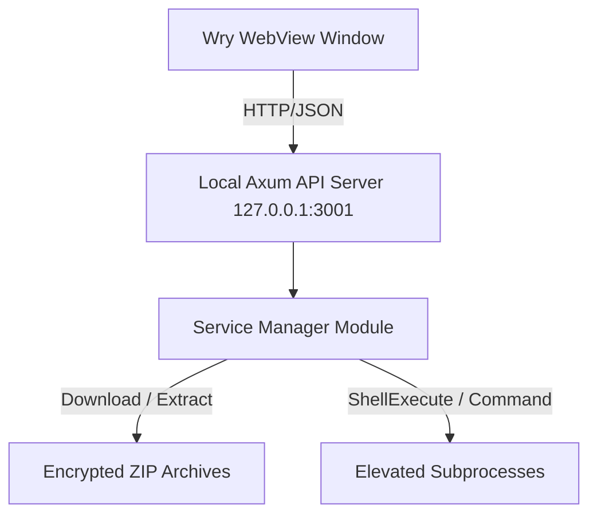

# 🚀 OpenHub: Cross-Platform Service Launcher Platform

OpenHub is a modular, high-performance, GUI-driven application launcher platform written in **Rust** and **React (TypeScript)**. It is designed to host, update, and manage third-party software payloads, loaders, and administrative utilities (like cleaners) with built-in Privilege Escalation (UAC elevation) on Windows and GTK mapping on Linux.

---

## 🏗️ Architecture Overview

The platform uses a split-process client-server architecture running locally on the user's host:



### 1. The Rust Core (Backend)
- **Local Web Server**: Powered by [Axum](https://github.com/tokio-rs/axum) and [Tokio](https://tokio.rs/) running on `127.0.0.1:3001` to process API routes asynchronously.
- **System Webview Shell**: Powered by [wry](https://github.com/tauri-apps/wry) to display the frontend.
  - **Windows Support**: Uses `winit` for window lifecycle handling. Employs `FreeConsole` to detach standard console streams and hide cmd shells when not running in developer mode.
  - **Linux Support**: Uses GTK (`gtk-rs`) window binding.
- **Process & Privilege Control**: Uses Windows API bindings to call `ShellExecuteW` and `ShellExecuteExW` with the `runas` verb for elevated UAC context execution.

### 2. The Web GUI (Frontend)
- **Framework**: Vite + React + TypeScript.
- **Styling**: Vanilla CSS utilizing custom layout algorithms (HUD layout editor, context menu hooks, screenshot slideshow carousel).
- **Communication**: Queries the Rust server's local API loop to monitor asynchronous download processes.

---

## 📡 API Reference Specification

All client operations interact with the local Axum endpoints:

| Endpoint | Method | Payload | Description |
|---|---|---|---|
| `/api/service` | `GET` | None | Reads the local configuration database (`applicationdata.json`) and queries target package head headers to estimate payload file size. |
| `/api/refresh` | `POST` | None | Compares local installation metadata against the remote registry version (e.g., `data/subh/version.txt`). |
| `/api/install` | `POST` | `{ "password": "..." }` | Automatically fetches, decrypts, and unzips the software payload package into the designated sub-directory. |
| `/api/run` | `POST` | None | Spawns the main executable binary payload as Administrator. |
| `/api/run-tool-terminal/:name` | `POST` | None | Executes secondary batch files (e.g. `SUPER CLEANER.bat`) in a visible terminal window using `cmd.exe /c` (waiting for termination). |
| `/api/stop` | `POST` | None | Forces the termination of any running launcher payload subprocesses. |
| `/api/minimize` | `POST` | None | Minimizes the launcher window after successful payload launch. |
| `/api/save-hud` | `POST` | `{ "layout": "..." }` | Saves HUD state settings to `hud_layout.txt`. |

---

## 📂 Directory Layout

```
Documents/
├── README.md                      # Platform Documentation
├── .gitignore                     # Git Exclusions
├── data/
│   └── subh/
│       └── version.txt            # Live Telemetry Registry
└── OpenHub/
    ├── Cargo.toml                 # Backend dependencies (Wry, Axum, Tokio, Zip)
    ├── build.rs                   # Windows resources compiler setup
    ├── logic.txt                  # Functional design notes
    ├── WebView2Loader.dll         # MS Edge WebView2 binding library
    ├── data/
    │   ├── applicationdata.json   # Service configuration metadata
    │   └── sources.json           # Registry source URLs
    ├── src/
    │   ├── main.rs                # Application entrypoint & Wry config
    │   ├── api.rs                 # Axum Router & Endpoint handlers
    │   └── service/
    │       ├── mod.rs             # Service wrapper
    │       ├── manager.rs         # Download, Decryption, Extraction, Execution engine
    │       └── types.rs           # Serde serializable structs
    └── web_GUI/                   # React GUI source files
```

---

## 🛠️ Build & Installation Guide

### Prerequisites
- **Rust Toolchain**: Stable channel (Edition 2024).
- **NodeJS & PNPM**: For compiling the Web UI.

### Compilation Steps
1. **Compile Web GUI**:
   ```bash
   cd OpenHub/src/web_GUI
   pnpm install
   pnpm build
   ```
2. **Compile Application**:
   ```bash
   cd ../../
   cargo build --release
   ```