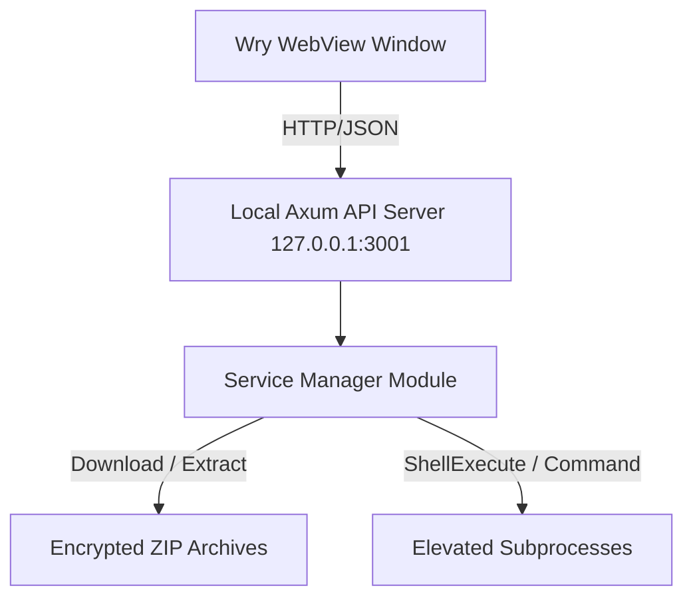

# OpenHub: Cross-Platform Service Launcher Platform
Let’s be real: building a smooth, privilege-escalating service launcher across Windows and Linux is a pain in the ass. OpenHub is our take on a modular, high-performance GUI launcher platform built with **Rust** and **React (TypeScript)**. It handles hosting, updating, and managing third-party payloads, loaders, and cleanup scripts without looking like a bloated Electron app.
> **The ZIP Password is 1.**
> Yes, seriously. We hardcoded it. Why? Because Windows Defender loves to flag automated payload drops as false positives. encrypting the ZIP with 1 is just enough security theater to stop automated scanners from chewing up our binaries on download, without making the user jump through hoops.
> 
## 🏗️ Architecture & Real Talk
Instead of fighting Tauri's strict IPC macros, we chose a split-process client-server architecture running locally on the loopback adapter. It gave us way more control over background threads, but it introduced its own set of weird quirks.

### 1. The Rust Core (Where the heavy lifting happens)
 * **The Local Web Server:** Powered by **Axum** and **Tokio** on 127.0.0.1:3001. Running an actual HTTP server locally sounds like overkill, but it makes handling asynchronous background downloads a breeze compared to passing fragmented strings across a webview bridge.
 * **The Window Shell:** We used **Wry** directly to render the frontend.
   * *Windows Fuckup:* Getting rid of the ugly command prompt window when the app starts was a nightmare. We had to use FreeConsole to violently detach standard console streams so it doesn't look like malware launching a terminal behind your sleek UI.
   * *Linux:* Standard GTK (gtk-rs) bindings. Far less dramatic than Windows.
 * **Privilege Escalation:** To bypass UAC prompts cleanly on Windows, standard Command::new doesn't cut it. We had to dive into raw Win32 API bindings to call ShellExecuteW and ShellExecuteExW using the runas verb to force admin context.
### 2. The Web GUI
 * **The Stack:** Vite + React + TypeScript.
 * **The Styling:** We went with Vanilla CSS because we got tired of build-tool configuration hell breaking our custom layout engines (the HUD editor and the screenshot carousel).
## 🛠️ API Reference Specification
The UI doesn't guess what the backend is doing; it polls these local Axum endpoints. Here is what's actually happening under the hood:
| Endpoint | Method | What it *actually* does |
|---|---|---|
| /api/service | GET | Reads applicationdata.json. It pings the remote payload head headers to guess file sizes before you commit to a download. |
| /api/refresh | POST | Checks if you're outdated by comparing local metadata against a raw version.txt file hosted on a remote registry. |
| /api/install | POST | Fetches the payload, throws that glorious password 1 at it, extracts it, and hopes the file paths don't hit the Windows 260-character limit. |
| /api/run | POST | Spawns the main payload executable with full admin privileges. |
| /api/run-tool-terminal/:name | POST | For sidecar scripts (like SUPER CLEANER.bat). It intentionally spawns a visible cmd.exe /c window because users panic if a cleanup tool runs invisibly without showing progress. |
| /api/stop | POST | The panic button. Mentally executes a brute-force termination of any subprocess spawned by the launcher. |
| /api/minimize | POST | Hides the launcher UI out of sight once the main payload successfully executes. |
| /api/save-hud | POST | Dumps your UI custom layout positions directly into a flat hud_layout.txt file. |
## 📂 Directory Layout
Keep this structure intact. If you move WebView2Loader.dll, Windows users will just get a blank screen or a crash on launch.
```
Documents/
├── README.md                      # This file
├── .gitignore                     # Stuff we don't want on GitHub
├── data/
│   └── subh/
│       └── version.txt            # Remote telemetry version tracker
└── OpenHub/
    ├── Cargo.toml                 # Crates (Wry, Axum, Tokio, Zip, Winapi)
    ├── build.rs                   # Compiles manifest files so Windows knows we want admin perms
    ├── logic.txt                  # Scribbled design notes and logic flows
    ├── WebView2Loader.dll         # MS Edge rendering engine link (DO NOT DELETE)
    ├── data/
    │   ├── applicationdata.json   # Where the service configurations live
    │   └── sources.json           # Remote URL download registries
    ├── src/
    │   ├── main.rs                # App entrypoint and Wry initialization
    │   ├── api.rs                 # The Axum routing table
    │   └── service/
    │       ├── mod.rs             # Module entry
    │       ├── manager.rs         # The messy core: Download, decrypt, unzip, execute
    │       └── types.rs           # Serde structs for JSON serialization
    └── web_GUI/                   # Source files for the React interface

```
## 🔨 Build & Installation Guide
Make sure you compile the frontend *before* building the Rust binary. The backend embeds the built UI assets directly into the final executable so you don't have to distribute a loose folder of HTML and JS files.
 1. Compile the Web GUI
   Prerequisites: NodeJS & PNPM
   Navigate to the frontend directory, install the node modules, and run the production build pipeline.
   
 2. Compile the Rust Application
   Prerequisites: Rust Toolchain (Stable)
   Head back to the root project directory and compile the binary. We use the release flag here to strip debugging symbols and ensure the async tasks don't lag.

   
